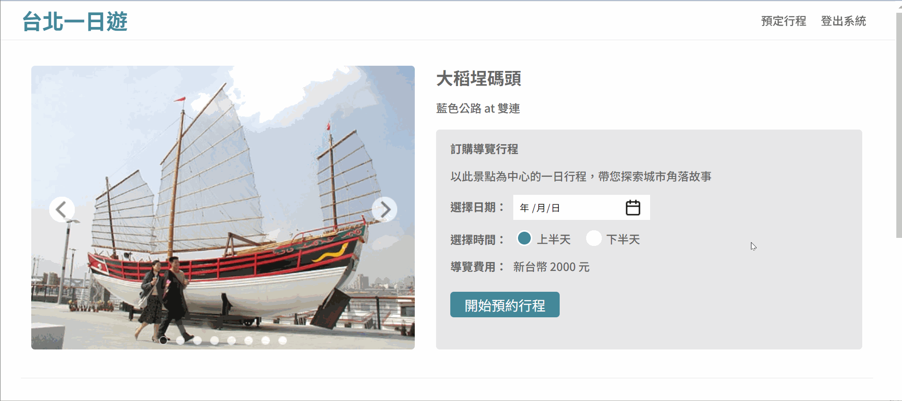

# [Taipei-Day-Trip]

## Description
Taipei-Day-Trip is a web application that allows users to browse and book trips to popular attractions in Taipei City.
With this application, users can easily find detailed information about attractions, including descriptions, photos, addresses, and transportation options. 
Users can also search for attractions by category and order trips on specific dates.

## Demo
- Infinite Scroll


## Features
- Search for attractions by keywords or MRT.


- Shopping Cart System



- Responsive Web Design (RWD)


- Connect to the database using connection pool and optimize queries with index settings.

### Home Page
The home page of the Taipei-Day-Trip project allows you to view all the attractions of Taipei City. 
You can also search for specific categories by using the search box. 
As you scroll down, more attractions will be loaded dynamically to the page.

### Attraction Page
On the attraction page, you can see the detailed information of a specific attraction, including its name, category, description, address, transportation, MRT station, and images. 
Additionally, you can order a trip to this attraction.
You can select the date you want to visit and see the price of the trip. When you click the "Order" button, you will be redirected to the order page.
### Order page
On the Order page, you can review your order details and provide your credit card information to complete the purchase. For testing purposes, you can use the following credit card information:

```
card number: 4242-4242-4242-4242
expirde date: 01/25
CVS: 123
```
After double-checking your order details and entering your credit card information, click "Submit" to proceed with the purchase. You will then be redirected to the Thank You page.

### Thanks page
This page displays that your order was successful and returns the order information.

The above webpage layout was created based on UI/UX designer's Figma design.
## Technologies Used
* [HTML](https://developer.mozilla.org/en-US/docs/Web/HTML): Used for creating and structuring content for the web.
* [CSS](https://developer.mozilla.org/en-US/docs/Web/CSS): Used for describing the presentation of Web pages, including colors, layout, and fonts.
* [JavaScrpit]([https://www.w3schools.com/js/js_htmldom_document.asp](https://developer.mozilla.org/en-US/docs/Web/JavaScript)): Used to interaction with the site was mostly limited to interacting with forms, giving feedback to the user, detecting when they do certain things and interaction with web pages,. 
* [AWS EC2](https://aws.amazon.com/tw/ec2/?trk=f8464984-daa7-4909-b7a9-c299cfbbc7fb&sc_channel=ps&ef_id=CjwKCAjw8-OhBhB5EiwADyoY1XXlzgDDxsy9EUFvPXFWzDTwsak_UNkKWgo-EbiKLurJy1lnl8nxVRoCoiEQAvD_BwE:G:s&s_kwcid=AL!4422!3!595905314555!p!!g!!ec2!17115101019!136234403676): Used for launch and manage virtual private servers (VPS), making it an ideal platform for hosting websites and applications. .
* [Python Flask](https://flask.palletsprojects.com/en/2.2.x/): Used to build the RESTful API for the back-end server, handling data storage and retrieval, authentication, and other server-side functionalities.
Python Flask was used to build the RESTful API that responds to requests from the front-end. The API is responsible for retrieving and storing data from a MySQL database, including information about attractions, members, and orders.
* [MySQL](https://www.mysql.com/): Used for store information like attractions data, members ata, orders data.
* [Git](https://git-scm.com/): Used for version control and collaboration.
* [Github](https://github.com/): Used for version control and collaboration, allowing multiple developers to work on the same codebase simultaneously.
* [VS Code](https://code.visualstudio.com/): Used as the primary code editor.

### Test account
```
account:test@test
password:test
```

## Usage
To use this application, follow these steps:

1. Navigate to the project URL in your web browser.
2. If you do not have an account, click the "Sign Up" button to create a new account or use test account.
3. Log in to the application using your credentials.
4. From the home page, you can view all Taipei attractions.
5. Click on an attraction to view its introduction.
6. Select the day you want to visit and see the price.
7. Click "Order" to view the details of your order.
8. Enter your payment information.
9. Confirm your order.


## Contact
If you have any questions, comments, or suggestions for this project, please feel free to contact me:

Email: lynn02110211@gmail.com
GitHub: RitaChang5527


Thank you again for your interest in this project!
